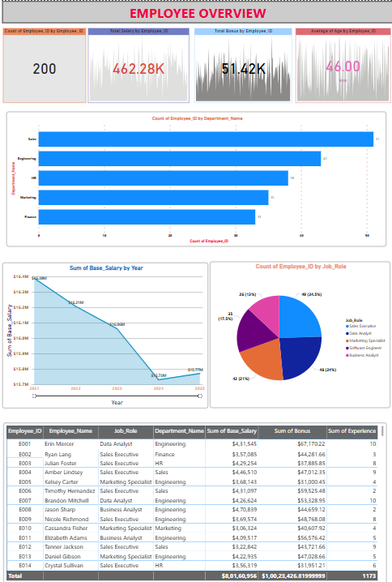
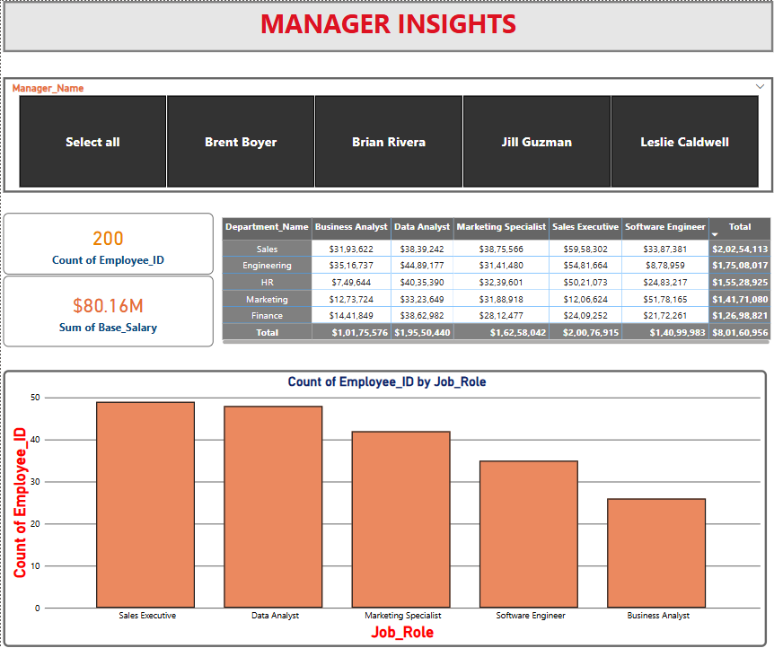

# 📊 Employee Analysis Dashboard (Power BI)

This project presents an interactive **Employee Analysis Dashboard** built using **Power BI** and an Excel-based dataset. It focuses on analyzing key HR metrics such as employee count, salary distribution, department-wise breakdown, and manager-wise performance.

## 📁 Dataset
The dataset is stored in Excel format and includes the following relational tables:
- **Employee_Details**: Basic info like ID, Name, Gender, DOB, Join Date, Department ID
- **Salary_Info**: Base salary, bonus, tax, and year of payment
- **Job_Info**: Employee job roles
- **Department**: Department names and IDs
- **Manager_Info**: Manager assigned to each employee

## 📌 Key Dashboard Features
- Total employees, average age, total salary and bonus
- Employee distribution by department and job role
- Manager-wise employee insights with slicers
- Salary trends over years using line charts
- Fully responsive layout with filters and interactivity

## 📎 Tools Used
- **Power BI** (for modeling, DAX, and visualization)
- **Microsoft Excel** (as data source)

### 📌 Employee Overview Dashboard

This dashboard provides a high-level view of employee data, including:

- Total employee count, salary, bonus, and average experience
- Department-wise and job role-wise employee distribution
- Year-over-year salary trends
- Interactive employee table with full details

### 👔 Manager Insights Dashboard

This dashboard helps analyze employee distribution and salary data based on selected managers:

- Manager-based filtering with button slicers
- Department-wise salary breakdown by job role
- Total salary and employee count KPIs
- Job role distribution bar chart

